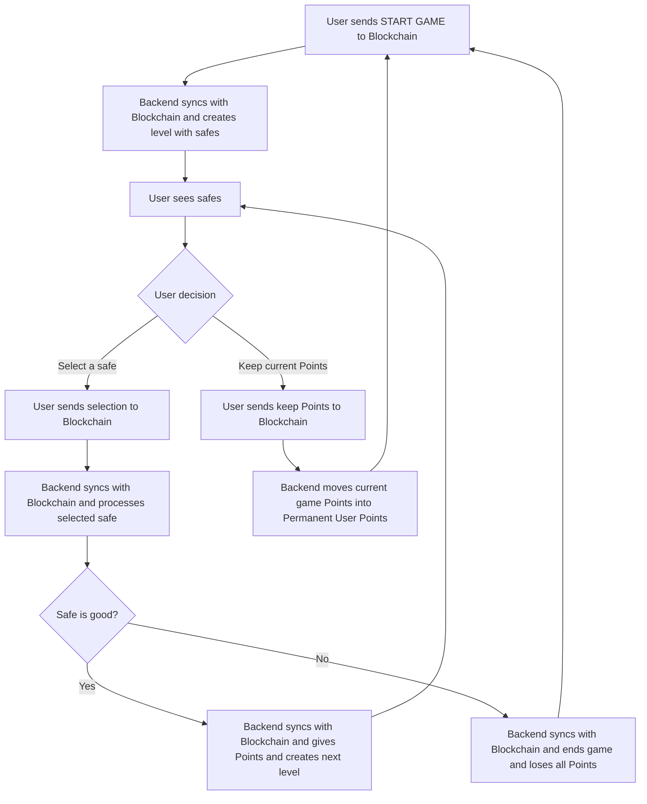

# Safe Solver - On Chain Template

https://github.com/user-attachments/assets/ff52646c-20f1-41b5-b421-34b49d3f1a79
<!--  -->

Safe Solver is a typescript *on-chain* turn chance based game .  
And serves as a template for building on-chain games.

> It contains custom contracts, but normally you would not need to modify them.

To start you must have some dependencies installed.
- [Deno](https://docs.deno.com/runtime/getting_started/installation/)
- [Node.js](https://nodejs.org/en/download/)
- [Compact](https://docs.midnight.network/getting-started/installation)
- [Forge](https://getfoundry.sh/introduction/installation)

# Quick Start
```sh
# Install packages
deno install --allow-scripts && ./patch.sh

# Compile contracts
deno task build:evm
deno task build:midnight

# Launch Paima Engine Node
deno task dev

# Now you are ready to play!
```
Navigate to [http://localhost:5173/](http://localhost:5173/)

## How does this game work

The main loop of the game works as follows:



## How to use this template

1. Clone this repository
```sh
git clone https://github.com/effectstream/safe-solver.git
```
2. Create the **Frontend** for your game.
3. Modify the **Database Schema**.
4. Modify the **API endpoints**.
5. Modify the **State Machine** (on-chain logic).
6. Publish your game.

The source code is organized into packages.

#### Frontend 
`/packages/frontend/*`

Contains an example game written in TypeScript and Three.js.
```sh
cd packages/frontend
npm install

# Start the frontend
npm run dev
# or
npm run build && npm run serve
``` 

Normally you would want to create your own frontend and replace this one included.
We provide this as a template to help you get started.

In particular, this racing game simulates the race on-chain, so the simulation can both run in the backend and on the frontend.

#### Database 

After the the first quick start launch, you can update the database schema.
Once the schema is modified:

* `/packages/client/database/src/migrations/database.sql`
* `/packages/client/database/src/sql/game-queries.sql`

Once these files are modified, you can update the database you can create TypeScript bindings for the database queries:
```sh
deno task -f @safe-solver/database pgtyped:update
```

#### API Endpoints

The API endpoints are defined in the `/packages/client/node/src/api.game.ts` file.

You can add your own API endpoints here.
For example, you can add an endpoint to get the user's latest race results.

#### State Machine (On-Chain Logic)

You can write your own on-chain logic rules in Typescript
For example, each time the user inputs starts a race, the state machine can simulate the race and update the database with the results.

The state machine is defined in two files:
* `/packages/shared/data-types/src/grammar.ts`
* `/packages/client/node/src/state-machine.ts` 

The first defines the `grammar`, or the custom commands that can be executed on-chain.  
The second defined the implementation of the custom commands through `state transitions`.

## Testnet & Mainnet Deployment

First you need to deploy the contracts to the testnet (and/or mainnet).

```sh
# Navigate to the EVM contracts directory
cd packages/shared/contracts/evm-contracts

# edit hardhat.config.ts network section with your settings, wallet with funds and RPC URL

# Then deploy the contract to the testnet
deno task deploy:testnet
```

Now you can run the game on testnet:
```sh
deno task testnet
```

